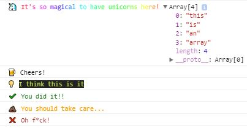

# Custom Console Logging with Emoji and CSS styling

Debugging JavaScript can be painful and often means spending hours looking at boring console logs. Inspired by [console-dot-emoji](https://github.com/ines/console-dot-emoji) by ines, I made my own console logger, not only with emojis &mdash; but with CSS styles. Logging to the console is finally fun again, thanks to `console.beer` :beer: and `console.unicorn` 🦄.


# Example

Simply include `log.emoji.ecma5.js` or `log.emoji.ecma6.js` in your project or copy/past/adapt the code.

```javascript
// Logging to the console
log.unicorn("It's so magical to have unicorns here!",["this", "is", "an", "array"]);
log.beer("Cheers!");
log.info("I think this is it");
log.success("You did it!!");
log.warn("You should take care...");
log.error("Oh f*ck!");
```
//Output



# License
Published under the MIT license.
Inspired by and adapted from [console-dot-emoji](https://github.com/ines/console-dot-emoji) by ines.
